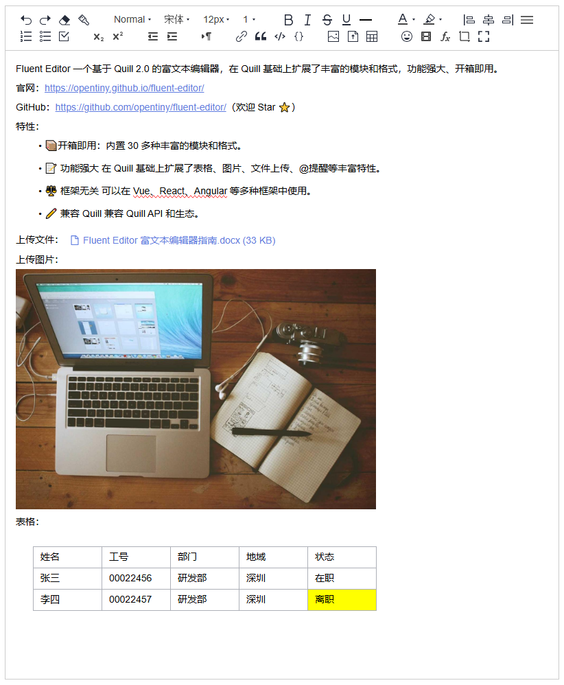

# TinyEditor

<!-- ALL-CONTRIBUTORS-BADGE:START - Do not remove or modify this section -->

[](#contributors-)

<!-- ALL-CONTRIBUTORS-BADGE:END -->

TinyEditor is a rich text editor based on Quill 2.0, which extends Quill with rich modules and formats such as table, image, link, clipboard, emoji, file, mention, and quick menu. It is framework-independent, compatible with Quill API, and compatible with Quill module ecosystem.

English | [简体中文](README.zh-CN.md)

## Features

TinyEditor has the following features and advantages:

- Contains more than 30 modules and formats, in addition to the 21 built-in formats in Quill, it also extends and enhances 15 modules and formats such as table, image, link, counter, emoji, file, clipboard, mention, quick menu, screenshot, etc.
- Powerful table function, supports inserting table with specified rows and columns in the toolbar, table row height/column width dragging, inserting rows/columns, deleting rows/columns, merging/splitting cells, and other rich table operations.
- It is not related to frameworks and can be used in multiple frameworks such as Vue, React, Angular, etc.
- Compatible with all Quill APIs, Quill ecosystem modules and formats.



## Quick Start

Install TinyEditor:

```shell
npm i @opentiny/fluent-editor
```

Write html：

```html
<div id="editor">
  <p>Hello TinyEditor!</p>
</div>
```

Import style:

```css
@import '@opentiny/fluent-editor/style.css';
```

Initialize the TinyEditor editor:

```javascript
import TinyEditor from '@opentiny/fluent-editor'

const editor = new TinyEditor('#editor', {
  theme: 'snow',
})
```

## Development

```shell
git clone git@github.com:opentiny/tiny-editor.git
cd tiny-editor
pnpm i
pnpm dev
```

Open your browser and visit: [http://localhost:5173/tiny-editor/](http://localhost:5173/tiny-editor/)

## Contributors ✨

Contributors are community members who have 1 or more PR merged in OpenTiny.

Thanks goes to these wonderful people ([emoji key](https://allcontributors.org/docs/en/emoji-key)):

<!-- ALL-CONTRIBUTORS-LIST:START - Do not remove or modify this section -->
<!-- prettier-ignore-start -->
<!-- markdownlint-disable -->
<table>
  <tbody>
    <tr>
      <td align="center" valign="top" width="14.28%"><a href="https://github.com/zzxming"><br /><sub><b>zzxming</b></sub></a><br /><a href="https://github.com/opentiny/tiny-editor/commits?author=zzxming" title="Code">💻</a></td>
      <td align="center" valign="top" width="14.28%"><a href="https://github.com/Janson1012"><br /><sub><b>Janson1012</b></sub></a><br /><a href="https://github.com/opentiny/tiny-editor/commits?author=Janson1012" title="Code">💻</a></td>
      <td align="center" valign="top" width="14.28%"><a href="https://kagol.github.io/blogs"><br /><sub><b>Kagol</b></sub></a><br /><a href="https://github.com/opentiny/tiny-editor/commits?author=kagol" title="Code">💻</a></td>
      <td align="center" valign="top" width="14.28%"><a href="https://github.com/kiss-keray"><br /><sub><b>keray</b></sub></a><br /><a href="https://github.com/opentiny/tiny-editor/commits?author=kiss-keray" title="Code">💻</a></td>
      <td align="center" valign="top" width="14.28%"><a href="https://github.com/qwangry"><br /><sub><b>qwangry</b></sub></a><br /><a href="https://github.com/opentiny/tiny-editor/commits?author=qwangry" title="Code">💻</a></td>
      <td align="center" valign="top" width="14.28%"><a href="https://github.com/jany55555"><br /><sub><b>jany55555</b></sub></a><br /><a href="https://github.com/opentiny/tiny-editor/commits?author=jany55555" title="Code">💻</a></td>
    </tr>
  </tbody>
</table>

<!-- markdownlint-restore -->
<!-- prettier-ignore-end -->

<!-- ALL-CONTRIBUTORS-LIST:END -->

## Credits ❤️

Thanks to:

- The [quill](https://github.com/slab/quill) project, which is an API-driven rich text editor with a modular architecture, good scalability, ease of use, and cross-platform support. TinyEditor extends and enhances a large number of modules and formats such as tables, images, and hyperlinks based on Quill.
- The [quill-better-table](https://github.com/soccerloway/quill-better-table) project, which enhances the built-in table module of Quill and adds rich functionality. TinyEditor's table operation functionality is based on quill-better-table.
- The [quill-emoji](https://github.com/contentco/quill-emoji) project, which is a Quill module for emoji. TinyEditor's insert emoji function is based on quill-emoji.
- The [quill-blot-formatter](https://github.com/Fandom-OSS/quill-blot-formatter) project, which is a Quill module for resizing images and videos. TinyEditor's image scaling function is based on quill-blot-formatter.

## License

[MIT](LICENSE)
